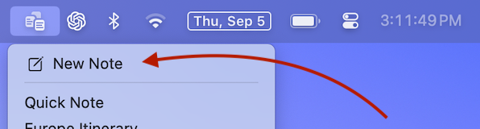
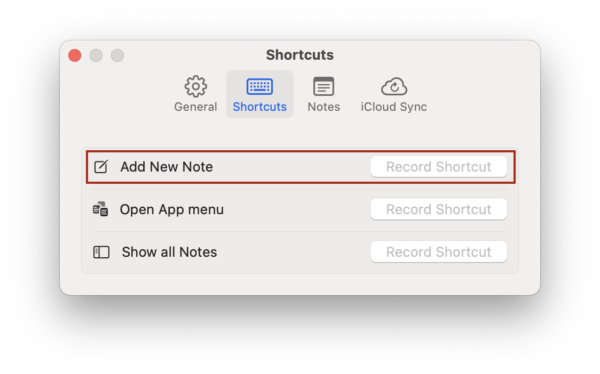
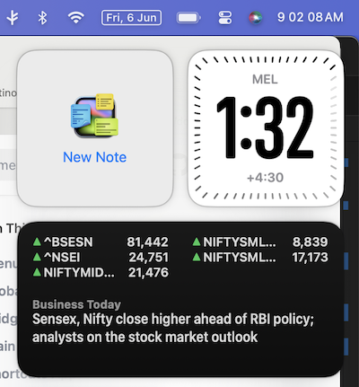
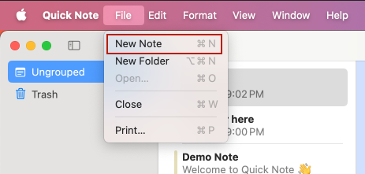
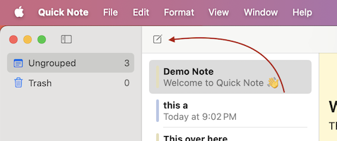
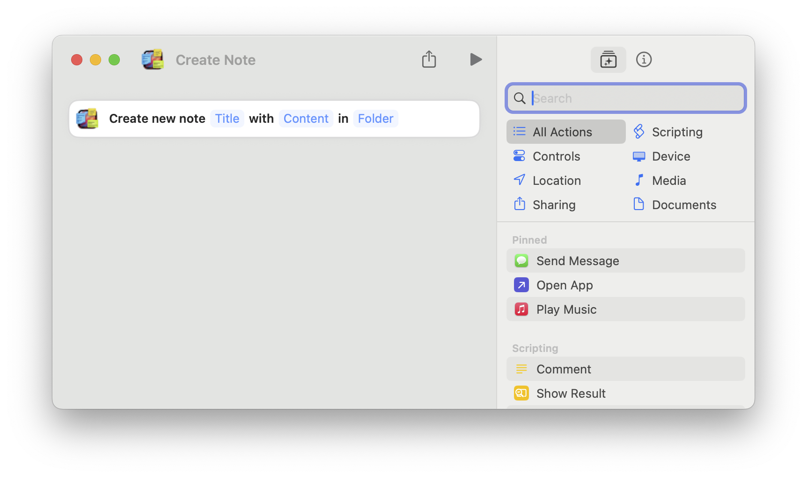

#  New Note

Quick Note is a powerful tool designed to streamline note-taking. You can create a new note in many different ways—using the menubar, global shortcuts, widgets, the main window, the Shortcuts app, Apple Script Editor, or even the Services menu. This flexibility ensures you can quickly capture ideas no matter how you work.

## Menubar
The default and easiest way to create a new note is to click on the Quick Note menubar icon, located at the top-right corner of your screen, and then select "New Note" from the dropdown menu.



## Global shortcut
You can set a global shortcut to create a new note. A global shortcut allows you to create a new note even while using a different application.
To set a global shortcut, open Quick Note `Settings` and select the 'Shortcuts' tab.



## Widget
You can add a New Note Widget that lets you create a new note from the Widget palette
To add a widget, open the widget palette from the home screen or settings menu, click on `Edit Widgets...`, and add Quick Note.



## Main Window
You can click on the main menu and select `Show all Notes` to open a window.
Click on the new note toolbar item or use the `File` Menu to create a new note.





## Shortcuts App
The Shortcuts app lets you automate tasks across Apple platforms using a visual, no-code interface.
You can add a new Action from the Shortcuts app that will let you create a new note as a part of Shortcut automation



## Apple Script Editor
You can use the `make new note` command from the Script Editor to create a new note.

```
tell application "Quick Note" to open (make new note)
```

## Terminal
Run the script command from Terminal. You can add this to your shell scripts also.
```
osascript -e 'tell application "Quick Note" to open (make new note)'
```

## Services Menu
You can create a new note from the global services menu. To do that, select text in any app and double-tap/right click to open the context menu.
Select `Services` menu, and select "New note in Quick Note menubar app"