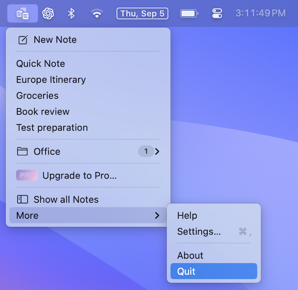

#  Quit App

Quick Note is a Menubar app that runs in the background. Unlike other apps, Quick Note does not quit simply by closing all the windows.

You can quit the app by following the steps mentioned below

1. Open the main menu
2. Select `More`
3. Tap on `Quit`

