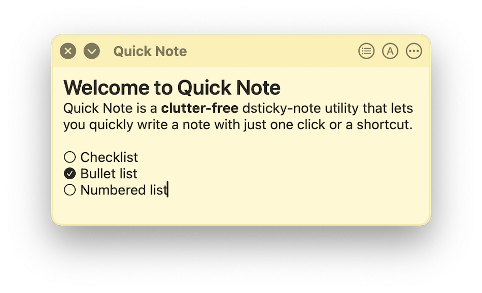

 
 
# Welcome to Quick Note

## FAQ

### Quick Note is not visible in the Menu bar
If you have a lot of apps in the Menu bar then macOS will manage them by hiding some menubar apps. To fix this, you can quit some existing menubar apps so that there is space for other apps.

### What do I get in the free version?
Yes, Quick Note is free to download from on the Mac app store.
In the free version, you can create up to 6 notes and use the app for 30 days

### What do I get after upgrading to the PRO version?
Upgrading to PRO will remove all limits imposed by the free version. [Show more details](quicknote://help/upgradingToPro)

### My notes are not syncing between devices
Please refer to [troubleshooting iCloud](https://google.com)

### I have two MacBooks. Can I access the notes from one MacBook to other?
Yes. You can do so by enabling iCloud sync in both the macs.

### How can I download the app on iPhone?
Quick Note is only available for Mac. It's **not** yet available on iPhone, iPad, Android and Windows.
